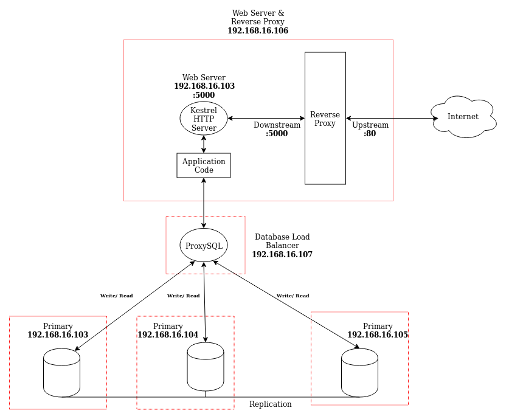

Muhammad Adistya Azhar
05111640000103

----------------------
# Implementasi Multi Master Group Replica

**Soal 1**: Desain dan implementasi infrastruktur
Arsitektur terdiri dari 3 database server, 1 database load balancer, 1 web server, dan 1 reverse proxy. Kotak merah menandakan berada dalam 1 vagrant machine.




----------------------------------

**Desain Infrastruktur Basis Data Terdistribusi & Load Balancing**

a. Database Server
   - Database 1
     - RAM: 512 MB
     - OS: Ubuntu 16.04
     - IP: 192.168.16.103
   - Database 2
     - RAM: 512 MB
     - OS: Ubuntu 16.04
     - IP: 192.168.16.104
   - Database 3
     - RAM: 512 MB
     - OS: Ubuntu 16.04
     - IP: 192.168.16.105

b. Database Load Balancer
- ProxySQL:
  - RAM: 512 MB
  - OS: Ubuntu 16.04
  - 192.168.16.107

c. Web Server & Reverse Proxy
  - Kestrel & Nginx
    - RAM: 1024 MB
    - OS: Ubuntu 16.04
    - 192.168.16.106


**Implementasi infrastruktur basis data terdistribusi**

a. Proses instalasi *database server*
Database yang digunakan adalah MySQL dengan plugin MySQL Group replication. Berikut adalah step yang harus dilakukan:

  1. Download MySQL Server dan MySQL Client binary (dilakukan di ketiga DB server)
      ```
      curl -OL https://dev.mysql.com/get/Downloads MySQL-5.7mysql-common_5.7.23-1ubuntu16.04_amd64.deb
      curl -OL https://dev.mysql.com/get/Downloads/MySQL-5.7/mysql-community-client_5.7.23-1ubuntu16.04_amd64.deb
      curl -OL https://dev.mysql.com/get/Downloads/MySQL-5.7/mysql-client_5.7.23-1ubuntu16.04_amd64.deb
      curl -OL https://dev.mysql.com/get/Downloads/MySQL-5.7/mysql-community-server_5.7.23-1ubuntu16.04_amd64.deb
      ```
  2. Set default MySQL password agar tidak perlu input manual saat instalasi (dilakukan di ketiga DB server)
      ```
      sudo debconf-set-selections <<< 'mysql-community-server mysql-community-server/root-pass password admin'
      sudo debconf-set-selections <<< 'mysql-community-server mysql-community-server/re-root-pass password admin'
      ```
  3. Run .deb file yang telah didownload pada step 1 (dilakukan di ketiga DB server):
      ```
      sudo dpkg -i mysql-common_5.7.23-1ubuntu16.04_amd64.deb
      sudo dpkg -i mysql-community-client_5.7.23-1ubuntu16.04_amd64.deb
      sudo dpkg -i mysql-client_5.7.23-1ubuntu16.04_amd64.deb
      sudo dpkg -i mysql-community-server_5.7.23-1ubuntu16.04_amd64.deb
      ```
  4. MySQL berkomunikasi menggunakan port 33061 dan 3306, maka kita harus membuka port tersebut (dilakukan di ketiga DB server):
      ```
      sudo ufw allow 33061
      sudo ufw allow 3306
      ```
  5. Setiap MySQL server membutuhkan file konfigurasi `my.cnf`. Agar group replication dapat berjalan, kita harus set beberapa variable. 
  Database server yang akan kita buat memiliki IP sebagai berikut: `192.168.16.103`, `192.168.16.104`, dan `192.168.16.105`. Ketiga nya akan berada dalam 1 group, dan berperan sebagai `write` dan `read`. Setiap group memiliki *identifier* yang unik, dan harus kita definisikan sendiri. Linux memiliki command `uuidgen` untuk membuat UUID. Output dari `uuidgen` akan digunakan untuk set variable `loose-group_replication_group_name="8f22f846-9922-4139-b2b7-097d185a93cb"`. Setelah set `loose-group_replication_group_name` kita harus menambahkan IP DB server ke dalam whitelist untuk menentukan IP mana saja yang boleh *connect* ke group. Parameter tersebut adalah `loose-group_replication_ip_whitelist="192.168.16.103, 192.168.16.104, 192.168.16.105"`. Ketiga member tersebut akan memberi data jika ada member yang baru join, maka agar pemberian data dapat terjadi, parameter `loose-group_replication_group_seeds` terisi menjadi `loose-group_replication_group_seeds = "192.168.16.103:33061, 192.168.16.104:33061, 192.168.16.105:33061"`.
  Agar *multi primary mode* nyala, kita harus mematikan *single primary mode* dengan cara ```loose-group_replication_single_primary_mode = OFF```.
  Setiap DB Server memiliki *host specific* konfigurasi, parameter berikut hanya berlaku dengan IP server dimana DB berjalan:
  ```
    bind-address = "192.168.16.103"
    report_host = "192.168.16.103"
    loose-group_replication_local_address = "192.168.16.103:33061"
  ```
  Berikut adalah contoh file `my.cnf`.

  ```
    !includedir /etc/mysql/conf.d/
    !includedir /etc/mysql/mysql.conf.d/
    [mysqld]

    # General replication settings
    gtid_mode = ON
    enforce_gtid_consistency = ON
    master_info_repository = TABLE
    relay_log_info_repository = TABLE
    binlog_checksum = NONE
    log_slave_updates = ON
    log_bin = binlog
    binlog_format = ROW
    transaction_write_set_extraction = XXHASH64
    loose-group_replication_bootstrap_group = OFF
    loose-group_replication_start_on_boot = OFF
    loose-group_replication_ssl_mode = REQUIRED
    loose-group_replication_recovery_use_ssl = 1

    # Shared replication group configuration
    loose-group_replication_group_name = "8f22f846-9922-4139-b2b7-097d185a93cb"
    loose-group_replication_ip_whitelist = "192.168.16.103, 192.168.16.104, 192.168.16.105"
    loose-group_replication_group_seeds = "192.168.16.103:33061, 192.168.16.104:33061, 192.168.16.105:33061"

    # Single or Multi-primary mode? Uncomment these two lines
    # for multi-primary mode, where any host can accept writes
    loose-group_replication_single_primary_mode = OFF
    loose-group_replication_enforce_update_everywhere_checks = ON

    # Host specific replication configuration
    server_id = 103
    bind-address = "192.168.16.103"
    report_host = "192.168.16.103"
    loose-group_replication_local_address = "192.168.16.103:33061"
  ```
  6. Restart MySQL Server
   `sudo systemctl restart mysql`
  7. Buat MySQL User khusus untuk proses replikasi, dan install `Group Replication Plugin`
  (dilakukan di ketiga DB server).
   ```
    mysql -u root -p
  ```
  ```
    msql> SET SQL_LOG_BIN=0;
    msql> CREATE USER 'repl'@'%' IDENTIFIED BY 'password' REQUIRE SSL;
    msql> GRANT REPLICATION SLAVE ON *.* TO 'repl'@'%';
    msql> FLUSH PRIVILEGES;
    msql> SET SQL_LOG_BIN=1;
   ```
   ```
  CHANGE MASTER TO MASTER_USER='repl', MASTER_PASSWORD='password' FOR CHANNEL 'group_replication_recovery';
   ```
   ```
  INSTALL PLUGIN group_replication SONAME 'group_replication.so';
   ```
  8. Mulai group replication. Ketika belum ada member yang belum join group, maka harus dilakukan step khusus. Harus dilakukan ini karena member akan bergantung pada member lain untuk mendapatkan data. Oleh karena itu, untuk member pertama yang join group, kita akan set agar tidak mengharapkan data. (Hanya dilakukan di salah 1 member)
  ```
  (192.168.16.103) mysql> SET GLOBAL group_replication_bootstrap_group=ON;
  (192.168.16.103) mysql> START GROUP_REPLICATION;
  (192.168.16.103) mysql> SET GLOBAL group_replication_bootstrap_group=OFF;
  ```
  Cek member sudah masuk grup:
  ```
  (192.168.16.103) mysql> SELECT * FROM performance_schema.replication_group_members;
  ```
  9. Join group untuk member yang lain dengan cara:
  ```
  (192.168.16.104) mysql> START GROUP_REPLICATION;
  ```
  ```
  (192.168.16.105) mysql> START GROUP_REPLICATION;
  ```
  Cek bahwa seluruh member sudah join group:
  ```
  (192.168.16.105) mysql> SELECT * FROM performance_schema.replication_group_members;
  ```

b. Proses instalasi *database load balancer* ProxySQL
  1. Download file dan install `.deb` ProxySQL
  ```
  curl -OL https://github.com/sysown/proxysql/releases/download/v1.4.4/proxysql_1.4.4-ubuntu16_amd64.deb
  sudo dpkg -i proxysql_*
  ```
  2. Start ProxySQL
  ```
  sudo systemctl start proxysql
  ```
  3. Konfigurasi monitoring MySQL member. Kita harus download `.sql` file yang berisi fungsi agar ProxySQL grou replication dapat berjalan. (Masuk ke salah 1 member MySQL)
  ```
    (192.168.16.103)> curl -OL https://gist.github.com/lefred/77ddbde301c72535381ae7af9f968322/raw/5e40b03333a3c148b78aa348fd2cd5b5dbb36e4d/addition_to_sys.sql
    
    (192.168.16.103) mysql -u root -p < addition_to_sys.sql
    (192.168.16.103) mysql -u root -p
    (192.168.16.103) mysql> CREATE USER 'monitor'@'%' IDENTIFIED BY 'monitorpassword';
    (192.168.16.103) mysql> GRANT SELECT on sys.* to 'monitor'@'%';
    (192.168.16.103) mysql> FLUSH PRIVILEGES;
  ```
  4. Tambahkan akun monitoring yang baru dibuat pada step 3 ke ProxySQL (run command pada server yang host ProxySQL)
  ```
  mysql -u admin -p -h 127.0.0.1 -P 6032 --prompt='ProxySQLAdmin> '
  ```
  ```
  ProxySQLAdmin> UPDATE global_variables SET variable_value='monitor' WHERE variable_name='mysql-monitor_username';
  ProxySQLAdmin> UPDATE global_variables SET variable_value='monitorpassword' WHERE variable_name='mysql-monitor_password';
  ProxySQLAdmin> LOAD MYSQL VARIABLES TO RUNTIME;
  ProxySQLAdmin> SAVE MYSQL VARIABLES TO DISK;
  ```
  5. Tambahkan MySQL member ke ProxySQL Server Pool
  Agar ProxySQL mengetahui MySQL member kita, maka MysSQL member harus dimasukkan ke dalam host group. Setiap host group teridentifikasi menggunakan angka. Host group memiliki 4 logical state:
     - **writers**: query yang mengubah data.
     - **backup writers**: query yang mengubah data, tapi hanya berjalan ketika primari writers bermasalah.
     - **readers**: query yang membaca data, tidak ada operasi mengubah.
     - **offline**: node yang bermasalah, ada network problem.
     
  Kita akan menggunakan identifier host group `1` untuk **offline**, `2` untuk **writer**, 3 untuk **reader**, dan `4` untuk *backup writer*.
  ```
  ProxySQLAdmin> INSERT INTO mysql_group_replication_hostgroups (writer_hostgroup, backup_writer_hostgroup, reader_hostgroup, offline_hostgroup, active, max_writers, writer_is_also_reader, max_transactions_behind) VALUES (2, 4, 3, 1, 1, 3, 1, 100);
  ```
  ```
  ProxySQLAdmin> INSERT INTO mysql_servers(hostgroup_id, hostname, port) VALUES (2, '192.168.16.103', 3306);
  ProxySQLAdmin> INSERT INTO mysql_servers(hostgroup_id, hostname, port) VALUES (2, '192.168.16.104', 3306);
  ProxySQLAdmin> INSERT INTO mysql_servers(hostgroup_id, hostname, port) VALUES (2, '192.168.16.105', 3306);
  ```
  ```
  ProxySQLAdmin> LOAD MYSQL SERVERS TO RUNTIME;
  ProxySQLAdmin> SAVE MYSQL SERVERS TO DISK;
  ```
  Cek MySQL member yang terdapat dalam hostgroup:
  ```
  ProxySQLAdmin> SELECT hostgroup_id, hostname, status FROM runtime_mysql_servers;
  ```
  4. Bikin MySQL member user yang akan digunakan oleh ProxySQL (dilakukan di salah 1 member)
  ```
  (192.168.16.103) mysql -u root -p
  ```
  ```
  (192.168.16.103) mysql> CREATE USER 'bloguser'@'%' IDENTIFIED BY 'password';
  (192.168.16.103) mysql> CREATE DATABASE blog;
  (192.168.16.103) mysql> GRANT ALL PRIVILEGES on blog.* to 'bloguser'@'%';
  (192.168.16.103) mysql> FLUSH PRIVILEGES;
  ```
  5. Tambahkan MySQL user pada step 4 ke ProxySQL (command dilakukan di ProxySQL server)
  ```
  mysql -u admin -p -h 127.0.0.1 -P 6032 --prompt='ProxySQLAdmin> '
  ```
  ```
  ProxySQLAdmin> INSERT INTO mysql_users(username, password, default_hostgroup) VALUES ('bloguser', 'password', 2);
  ProxySQLAdmin> LOAD MYSQL USERS TO RUNTIME;
  ProxySQLAdmin> SAVE MYSQL USERS TO DISK;
  ```

c. Proses instalasi webserver
  1. Install Nginx, .NET Core SDK & Runtime, NodeJS.
  ```
  sudo apt install nginx -y
  sudo ufw allow 'Nginx HTTP'

  wget -q https://packages.microsoft.com/config/ubuntu/16.04/packages-microsoft-prod.deb -O packages-microsoft-prod.deb
  sudo dpkg -i packages-microsoft-prod.deb

  sudo apt-get update -y
  sudo apt-get install apt-transport-https -y
  sudo apt-get update -y
  sudo apt-get install dotnet-sdk-2.2 -y


  wget -q https://packages.microsoft.com/config/ubuntu/16.04/packages-microsoft-prod.deb -O packages-microsoft-prod.deb
  sudo dpkg -i packages-microsoft-prod.deb

  sudo apt-get update -y
  sudo apt-get install apt-transport-https -y
  sudo apt-get update -y
  sudo apt-get install aspnetcore-runtime-2.2 -y

  curl -sL https://deb.nodesource.com/setup_8.x | sudo -E bash -
  sudo apt-get install nodejs -y
  ```
  2. Clone repo project
  ```
  mkdir /home/vagrant/projects
  cd /home/vagrant/projects
  git clone https://github.com/adisazhar123/dotnet-core-reactredux-blog.git
  cd /home/vagrant/projects/dotnet-core-reactredux-blog/src/App/Spa
  ```
  3. Install depedencies yang dibutuhkan project
  ```
  dotnet restore /home/vagrant/projects/dotnet-core-reactredux-blog/src/App/Spa
  npm install /home/vagrant/projects/dotnet-core-reactredux-blog/src/App/Spa/ClientApp
  ```

  4. Build project
  ```
  sudo rm -r /home/vagrant/projects/dotnet-core-reactredux-blog/src/App/Spa/wwwroot/Storage
  sudo ln -s /home/vagrant/projects/dotnet-core-reactredux-blog/src/App/Spa/Storage /home/vagrant/projects/dotnet-core-reactredux-blog/src/App/Spa/wwwroot
  dotnet publish --configuration Release
  mkdir /home/vagrant/projects/dotnet-core-reactredux-blog/src/App/Spa/bin/Release/netcoreapp2.2/publish/Storage
  mkdir /home/vagrant/projects/dotnet-core-reactredux-blog/src/App/Spa/bin/Release/netcoreapp2.2/publish/Storage/Uploads
  sudo chown www-data:www-data -R /home/vagrant/projects/dotnet-core-reactredux-blog/src/App/Spa/bin/Release/netcoreapp2.2/publish/Storage/Uploads
  ```

  5. Bikin symlink yang mengarah ke hasil build project. Ini akan digunakan oleh `systemd` untuk run service.
  ```
  sudo mkdir /var/www/AdisBlog
  sudo ln -s /home/vagrant/projects/dotnet-core-reactredux-blog/src/App/Spa/bin/Release/netcoreapp2.2/publish /var/www/AdisBlog  
  ```

  6. Bikin konfigurasi Nginx. Nginx akan listen ke port 80, dan meneruskan ke Kestrel port 5000.
  ```
  sudo cp /vagrant/adisblog /etc/nginx/sites-available
  sudo ln -s /etc/nginx/sites-available/adisblog /etc/nginx/sites-enabled
  sudo rm /etc/nginx/sites-enabled/default
  ```
  Isi file Nginx:
  ```
  server {
      listen        80;
      server_name   192.168.16.106;
      location / {
          proxy_pass         http://localhost:5000;
          proxy_http_version 1.1;
          proxy_set_header   Upgrade $http_upgrade;
          proxy_set_header   Host $host;
          proxy_cache_bypass $http_upgrade;
          proxy_set_header   X-Forwarded-For $proxy_add_x_forwarded_for;
          proxy_set_header   X-Forwarded-Proto $scheme;
      }
  }
  ```
  7. Bikin service `systemd`. Systemd akan mengeksekusi file `AdisBlog.dll` yang merupakan hasil dari build project. Untuk menjalankan service tersebut bisa menggunakan command `sudo service kestrel-adisblog start`.
  ```
  sudo cp /vagrant/kestrel-adisblog.service /etc/systemd/system
  sudo systemctl enable kestrel-adisblog.service
  sudo systemctl start kestrel-adisblog.service
  ```
  Isi file `kestrel-adisblog.service`:
  ```
  [Unit]
  Description=AdisBlog .NET Web API App & ReactJS running on Ubuntu

  [Service]
  WorkingDirectory=/var/www/AdisBlog/publish
  ExecStart=/usr/bin/dotnet /var/www/AdisBlog/publish/AdisBlog.dll
  Restart=always
  # Restart service after 10 seconds if the dotnet service crashes:
  RestartSec=10
  KillSignal=SIGINT
  SyslogIdentifier=dotnet-example
  User=www-data
  Environment=ASPNETCORE_ENVIRONMENT=Production
  Environment=DOTNET_PRINT_TELEMETRY_MESSAGE=false

  [Install]
  WantedBy=multi-user.target

  ```
  Agar `kestrel-adisblog.service` dapat berjalan ketika server boot, jalankan command berikut:
  ```
  sudo systemctl enable kestrel-adisblog.service
  ```
  8. Akses `192.168.16.106` melalui web browser.

  -----
  File `bash` yang digunakan untuk provisioning adalah:
  - Database:
   `deployMySQL103.sh`, `deployMySQL104.sh`, `deployMySQL105.sh`
  - Database Load Balancer:
  `deployProxySQL.sh`
  - Webserver:
    `deployWebServer.sh`

  Selain itu, terdapat file:
  - konfigurasi nginx:
  `adisblog`
  - cluster MySQL member:
  `cluster_bootstrap.sql`, `cluster_member.sql`
  - ProxySQL member:
  `create_proxysql_user.sql`
  - ProxySQL init
  `proxy.sql`
  - kestrel http service
  `kestrel-adisblog.service`
  - mysql configurations
  `my103.cnf`, `my104.cnf`, `my105.cnf`

  Setiap command yang dijelaskan di atas terdapat di dalam file yang disebutkan, dan akan diprovision secara otomatis.
